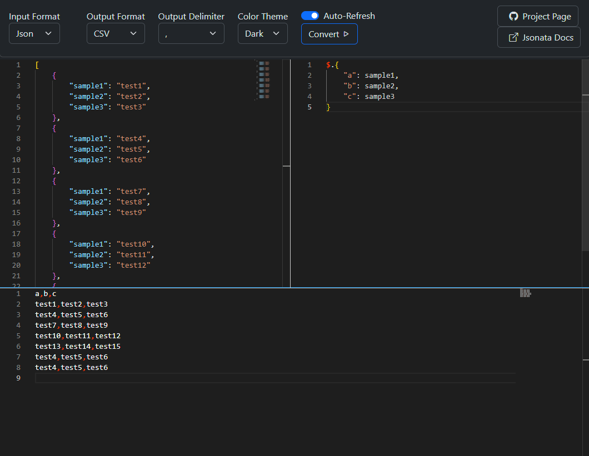

# JSONata Server
A server-side processor for [JSONata](https://github.com/jsonata-js/jsonata) that supports JSON and CSV input/output, with a feature-rich UI editor powered by [Monaco Editor](https://github.com/microsoft/monaco-editor)

## Features
- **Unlimited Processing Time**: Server-side processing removes browser limitations.
- **Flexible Input/Output**: Supports both JSON and CSV formats.
- **Data Persistence**: Saves data to local storage to prevent data loss.
- **Dark/Light Mode**: Choose your preferred theme.
- **Auto-refresh**: Automatically updates the data.
- **Advanced UI Editor**: Powered by [Monaco Editor](https://github.com/microsoft/monaco-editor).

## Screenshot


## Bindings
You can use [JSONata bindings](https://docs.jsonata.org/embedding-extending#expressionevaluateinput-bindings-callback) feature directly inside the JSONata expression window.
To do so, add `//BINDINGS` at the end of your JSONata query, followed by your custom bindings.
Example:
```json
"hello there!" ~> $firstLetterUppercase
//BINDINGS
{
   firstLetterUppercase(input) {
      return input.charAt(0).toUpperCase() + input.slice(1);
   }
}
```
will produce the following result
```json
"Hello there!"
```

## Getting Started

### Prerequisites
- Node.js installed on your machine.

### Installation
1. Clone the repository:
   ```sh
   git clone https://github.com/joussy/jsonata-playground.git
   ```
2. Navigate to the project directory:
   ```sh
   cd jsonata-server
   ```
3. Install the dependencies
   ```sh
   npm install
   ```

### Running the Server
Start the server:
   ```sh
   npm run start
   ```
### Accessing the Client
Open your browser and navigate to http://localhost:3000

## Docker
### Building the Docker Image
Clone the repository:
```sh
   git clone https://github.com/joussy/jsonata-playground.git
```
1. Navigate to the project directory:
```sh
cd jsonata-server
```
2. Build the Docker image:
```sh
docker build -t jsonata-server .
```
### Running the Docker Container
3. Run the Docker container:
```sh
docker run -d -p 3000:3000 --name jsonata-server jsonata-server
```
4. Open your browser and navigate to http://localhost:3000

## Dependencies

### Node.js Server
- [JSONata](https://github.com/jsonata-js/jsonata)
- [CSV](https://github.com/adaltas/node-csv/)
- [Express](https://github.com/expressjs/express)

### HTML Client
- [Vue.js](https://vuejs.org/)
- [Bootstrap](https://getbootstrap.com/)
- [Monaco Editor](https://github.com/microsoft/monaco-editor)

## Contributing
Pull requests are welcome. For major changes, please open an issue first to discuss what you would like to change.

## License
This project is licensed under the MIT License - see the LICENSE file for details.
